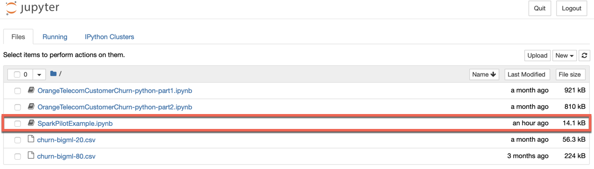
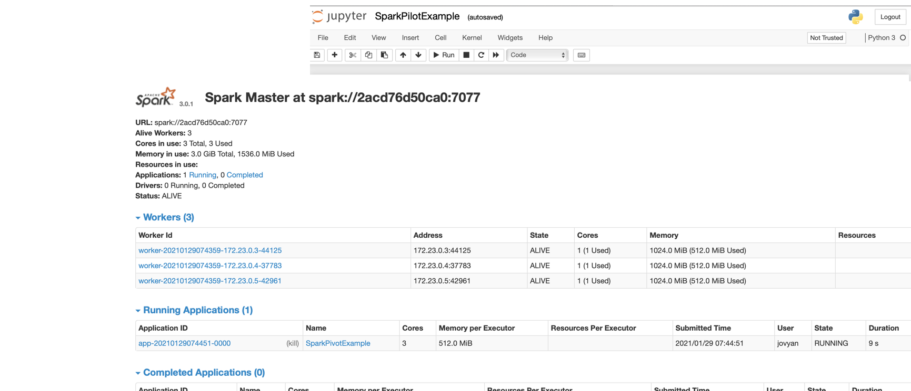
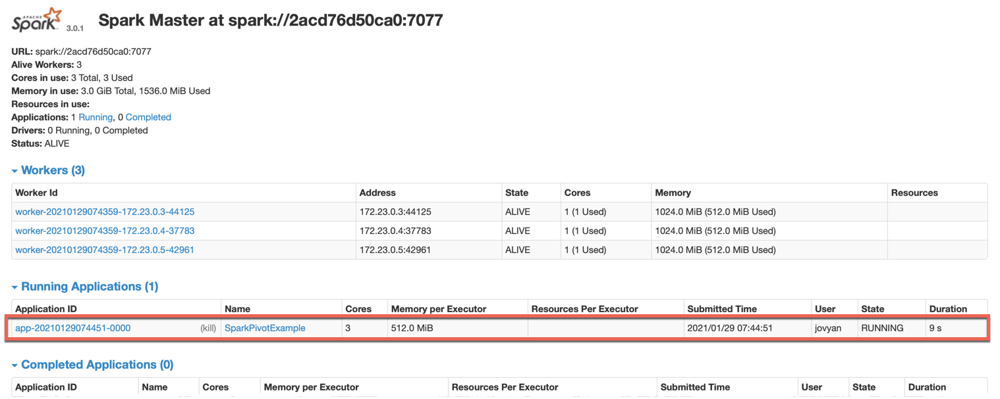

## spark-crash-course

Welcome to Apache Spark Crash Course, 

You will learn how to set up a 4 node SparkCluster (1 MasterNode, 3 WorkerNodes) using Docker and work with IDEs like pyCharm / Intelij.

### What you will learn ?
* Create a Standalone Spark Cluster 
* Connect Jupyter Notebook to Spark Cluster.
* How to Load/Extract the Data into Spark?
* Spark Structured and Unstructured APIs.
* Spark DataFrames 
    * Transformations 
    * Actions.
* Spark SQL intro.
* Run interactive Spark-SQL queries
    * Use logical operators, 
    * Manipulate tables/rows/columns,
    * Understand how joins work and use them and a lot more
    
Ref : https://spark.apache.org/docs/2.3.0/sql-programming-guide.html

[DataFrame FAQs](https://docs.databricks.com/spark/latest/dataframes-datasets/introduction-to-dataframes-python.html#dataframe-faqs)


#### Notebooks :
1. [Spark Pilot Notebook](./data/SparkPilotExample.ipynb)
2. [Spark Crash Course Notebook](./data/spark-crash-course-python.ipynb)

## Follow these instructions to Run Spark Cluster and SparkSQL Queries

> $ docker-compose up -d

#### Check if Spark Cluster is running

```shell script
$ docker-compose ps
            Name                          Command               State                            Ports                          
--------------------------------------------------------------------------------------------------------------------------------
spark-crash-course_jupyter_1   tini -g -- jupyter noteboo ...   Up      0.0.0.0:4041->4041/tcp, 0.0.0.0:8888->8888/tcp          
spark-master                   /bin/bash /master.sh             Up      6066/tcp, 0.0.0.0:7077->7077/tcp, 0.0.0.0:8080->8080/tcp
spark-worker-1                 /bin/bash /worker.sh             Up      0.0.0.0:8081->8081/tcp                                  
spark-worker-2                 /bin/bash /worker.sh             Up      8081/tcp, 0.0.0.0:8082->8082/tcp                        
spark-worker-3                 /bin/bash /worker.sh             Up      8081/tcp, 0.0.0.0:8084->8084/tcp  ```
```

#### Run a command in a running spark-master container
> $ docker exec -it ${CONTAINER_NAME} /bin/bash
* `-i` is the shortcut for --interactive option. This options is used for keep STDIN open even if not attached
* `-t` is the shortcut for --tty option, used to allocate a pseudo-TTY


```shell script
$ docker exec -it spark-master /bin/bash
```

### spark-submit

```
 spark-submit \
 --class org.apache.spark.examples.SparkPi \
--deploy-mode client \
--master spark://spark-master:7077 \
$SPARK_HOME/examples/jars/spark-examples_2.11-2.2.0.jar 10
```

### Sample JuypterNotebook

```shell script
(base) jovyan@pyspark-notebook:~$ nc -vuz spark-master 7077
Connection to spark-master 7077 port [udp/*] succeeded!

```

| Service           	| URI                                                      	|
|-------------------	|----------------------------------------------------------	|
| Jupyter           	| http://localhost:8888/?token=c33a7dc0eece                	|
| Spark Master      	| http://localhost:8080/                                   	|
| Spark Worker      	| http://localhost:8081/                                   	|
| Spark Application 	| http://localhost:8080/app/?appId=app-20210102232556-0000 	|

Logs
```
docker logs -f $(docker ps | grep jupyter | awk '{print $NF}')
```

```jupyterpython

import findspark
findspark.init()

from pyspark.sql import SparkSession

# create sparksession
spark = SparkSession \
    .builder \
    .master("spark://spark-master:7077") \
    .appName("Pysparkexample") \
    .getOrCreate()

# Check is SparkContext works
spark.range(0, 10).show()

# Lets Create a DataFrame with Schema
from pyspark.sql.types import *

schema = StructType([
    StructField("age", IntegerType(),True), 
    StructField("characters", StringType(),True)
])

data = ([(10, 'Walker'),
        ( 20, 'Stepher'),
         ( 150, 'Albus Dumbledore'),
         ( 70, 'Minerva McGonagall'),
         ( 63, 'Rubeus Hagrid'),
         ( 18, 'Oliver Wood'),
         ( 18, 'Harry Potter'),
         ( 12, 'Ron Weasley'),
         ( 13, 'Hermione'),
         ( None, 'Draco Malfoy')
        ])
    
    
df=spark.createDataFrame(data,schema=schema).cache()
df.show()

```


1. Run SparkSQL on Spark CLuster -  
2. Click on the Spark Pilot Notebook and Connect Jupyter Notebook to Spark Master -  
3. Check the Spark Job running on Spark Cluster (Master) 


